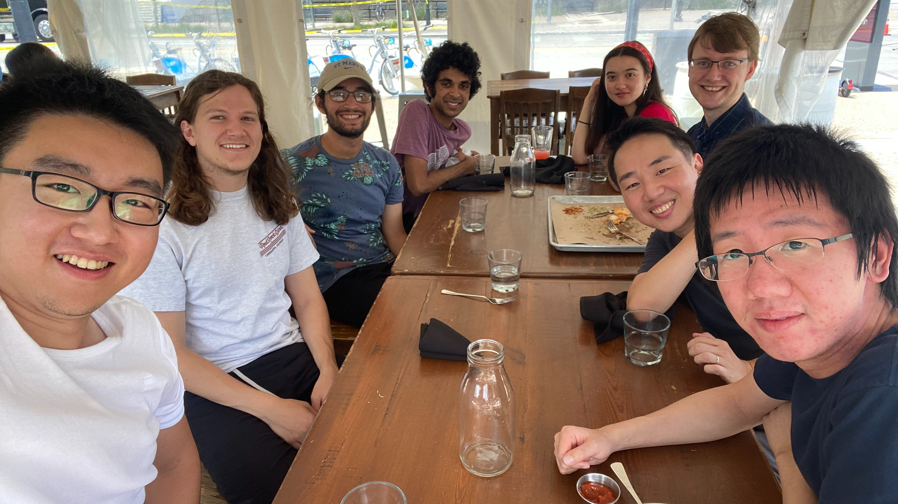

We research and develop tools for software assurance and design at [Carnegie Mellon University](https://www.cmu.edu/) led by Professor [Eunsuk Kang](https://eskang.github.io/) . We are a part of the [Software and Societal Systems Department](https://s3d.cmu.edu/) in  the [School of Computer Science](https://www.cs.cmu.edu/). 

If you are interested in joining our lab, please fill out [this form](https://docs.google.com/forms/d/e/1FAIpQLSddQ--uka2G7yDAaOrrtqH5BmBMmCAhq7GZp6zbwzG2ZXg1wA/viewform?usp=sf_link). 

  

    
  

  

    
  

  

    
  

  <!-- Next and previous buttons -->
  <a class="prev" onclick="plusSlides(-1)">&#10094;</a>
  <a class="next" onclick="plusSlides(1)">&#10095;</a>

 

<!-- The dots/circles -->

   
   
   

